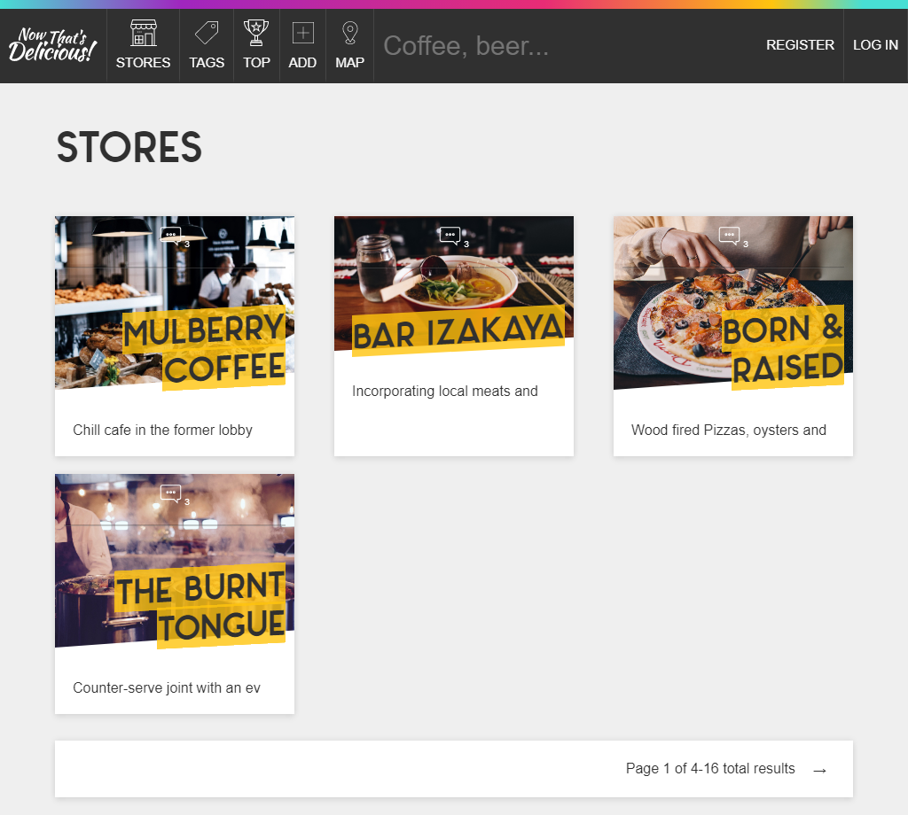
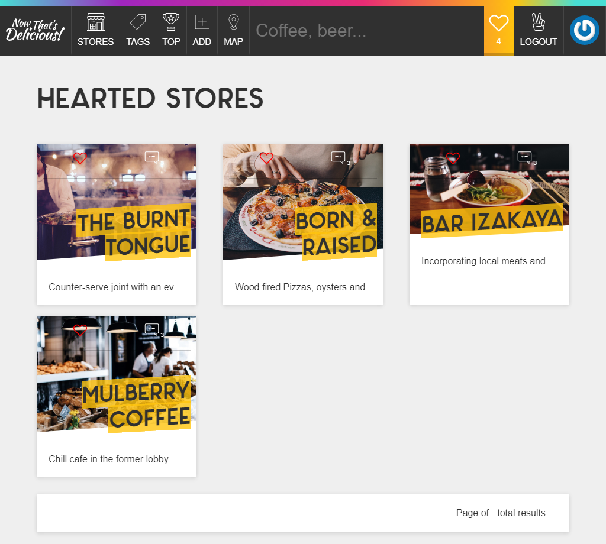
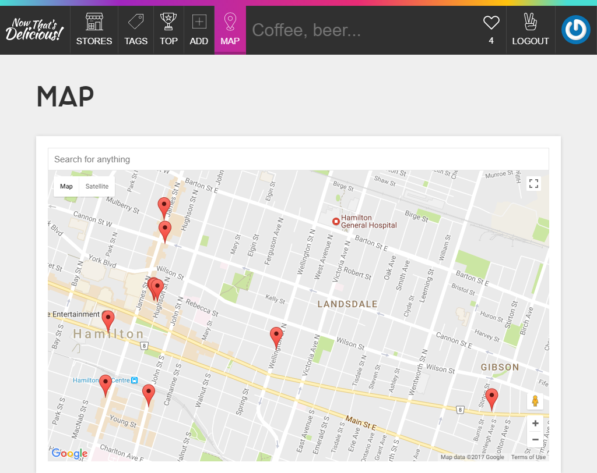

# Delicious 

A full stack restaurant application which users can search, geolocate, review and curate their favourite restaurants from around the world.

The application has three main models — Users, Stores and Reviews — all of which are relational. It is designed to hit upon many of today's application needs such as user authentication, database storage, Ajax REST API, file upload and image resizing.

_Homepage_

_Heart(Favourites Page)_

_Maps page_

Sample Email/ Passwords

|---|---|---|

|Wes Bos|wes@example.com|wes|

|Debbie Downer|debbie@example.com|debbie|

|Beau|beau@example.com|beau|

